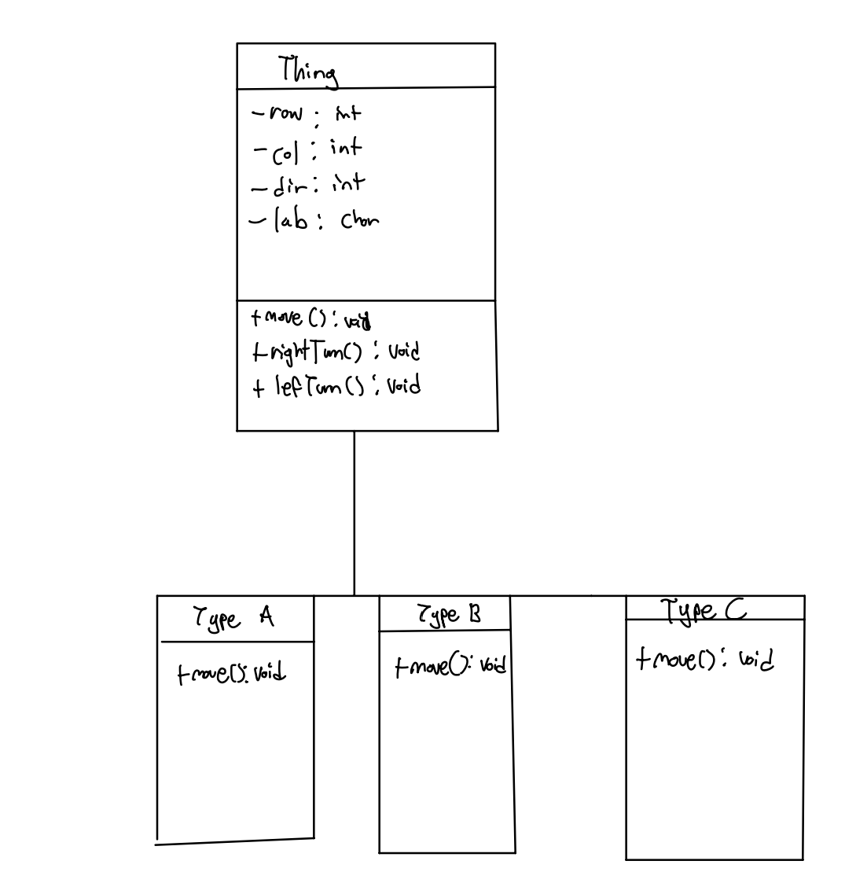

**OOP principles**
I have employed information hiding by declaring essential attributes as private and protected, which means that they can't be accessed from outside the class. I also employed inheritance by created three child classes (TypeA,TypeB,TypeC). Finally I employed polymorphism using the maybeTurn method.

**New Type**
I created TypeC object that move in a spiral pattern.

**OOP Design**
By making solid foundation of class Thing, I just need to extend Thing class when I'm creating a new type. This means there is less work to maintain.

**Polymorphism**
In maybeTurn() method that is declared in parent class Thing, it is override in each child classes A,B,C. 

**UML Diagram**
